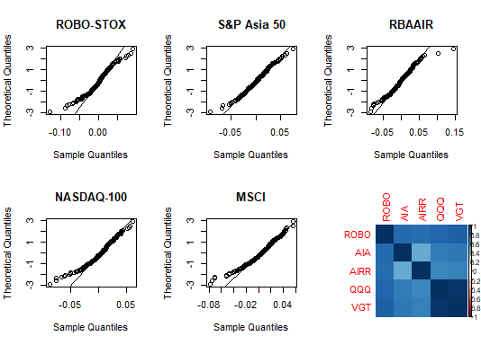

# Performance Analysis of ETFs
## ETF fund analysis and Portfolio Management

The objective of this project is to examine the performance of large AI ETFs and assess the risk environments.

An Exchange-Traded Fund (ETF) is a security that tracks an index or basket of securities and is traded on an exchange. 
ETFs are traded just like stocks, experiencing price fluctuations throughout the day.

## Advantages of ETFs
- Low Expense Ratio: Based on reports by Morgan Stanley Smith Barney ETF have an average expense ratio of 0.55 while mutual funds have about 1.34%
- Tax Advantages: ETF are more Tax beneficial than Mutual funds 
- Diversification: Provides diversification of a mutual fund plus the flexibility of a stock
- Transparency: Holdings updated end of each day
- Flexibility: Prices are reported every 15 seconds


### Import needed libraries
```
  library("quantmod")
  library("moments")
  library("tseries")
  library('corrplot')
``` 

### list of all ticker symbols for which data will be retrieved:
```
  tickers <- c("ROBO","AIA","AIRR","QQQ","VGT","^GSPC", "^IRX", "USNQX")
```
  - ROBO: Global Robotics and Automation Index ETF
  - Index: Robo-Stox Global Robotics and Automation Index
  - AIA:  iShares S&P Asia ETF
  - Index: S&P Asia 50 Index
  - AIRR:  First Trust RBA American Industrial Renaissance ETF
  - INDEX: Richard Bernstein Advisors American Industrial Renaissance Index
  - QQQ:  Invesco QQQ
  - Index: NASDAQ-100 Index
  - VTG: Vanguard Information Technology ETF
  - Index: MSCI US Investable Market Information Technology 25/50 Index
  - Retrieve weekly time-series data for ticker symbols from 2014-04-01 to 2019-04-01

  ### Column naming
  ```
  etf_names = c("ROBO", "AIA","AIRR", "QQQ", "VGT")
  etfIndex_names = c("ROBO-STOX", "S&P Asia 50","RBAAIR", "NASDAQ-100", "MSCI")
  market_names = c("S&P 500", "DJUSTC")
```
 ### Data Extraction and Importing CSVs 
 ```
  getSymbols(tickers, from="2014-04-01", to="2019-04-01", periodicity="weekly", return.class="xts")
  ROBO.STOX = matrix(scan("ROBO.STOX.csv", what=numeric()), nrow=261) 
  SPASIA50 = matrix(scan("SPASIA50.csv", what=numeric()), nrow=261)
  RBAAIR = matrix(scan("RBAAIR.csv", what=numeric()), nrow=261)
  DJUSTC = matrix(scan("DJUSTC.csv", what=numeric()), nrow=261)
  MSCI = matrix(scan("MSCI.csv", what=numeric()), nrow=261)
  ETF.AI = cbind(ROBO[,6], AIA[,6], AIRR[,6], QQQ[,6], VGT[,6])
  colnames(ETF.AI) = etf_names
  ETF.Index =  cbind(ROBO.STOX, SPASIA50, RBAAIR, USNQX[,6], MSCI)
  colnames(ETF.Index) = etfIndex_names
  market.index = cbind(GSPC[,6], DJUSTC)
  T_yield =  IRX[,6] / 100
  colnames(market.index) = market_names
```
### Calculate Log Returns on Prices
```
  get_logRet = function(prices){
    log_ret = matrix(0, nrow = dim(prices)[1], ncol = dim(prices)[2])
    for(i in 1:dim(log_ret)[2]){
      for(j in 1:dim(log_ret)[1]){
        log_ret[, i] = diff(log(prices[ ,i]))
      }
    }
    return(log_ret)
  }
  
  ETF.AI_logRet = get_logRet(ETF.AI)
  colnames(ETF.AI_logRet) = etf_names
  ETF.Index_logRet = get_logRet(ETF.Index)
  colnames(ETF.Index_logRet) = etfIndex_names
  market.index_logRet = get_logRet(market.index)
  colnames(market.index_logRet) = market_names
  
  #Data Compiled to be used for Analysis 
  
  LR_data = list(ETF.AI_logRet, ETF.Index_logRet, market.index_logRet)
```
### Plotting Histogram of Returns
```
  plotting = function(x, names){
    x = coredata(x)
    h <- hist(x, breaks = 104, density = 10, main = names, xlab = "Weekly Log Returns")
    # and fit a normal curve
    xfit <- seq(from = min(x, na.rm = TRUE), max(x, na.rm = TRUE), length = 104)
    yfit <- dnorm(xfit, mean = mean(x, na.rm = TRUE), sd = sd(x, na.rm = TRUE))
    yfit <- yfit * diff(h$mids[1:2]) * length(x)
    lines(xfit, yfit, col = "red", lwd = 2)
  }

  for(l in 1:length(LR_data)){
    if(dim(LR_data[[l]])[2] == 3){
      par(mfrow = c(1, 3))
    }
    else{
      par(mfrow = c(3, 2))
    }
    for(i in 1:dim(LR_data[[l]])[2]){
      plotting(LR_data[[l]][,i], colnames(LR_data[[l]])[i])
    }
  }
  ```
## ETFs Log Returns Distribtion
  
  
## Indicies Log Returns Distribtion  
  
  
## ETFs Log Returns Distribtion
  
### Normality Test of ETFs:
```
  par(mfrow=c(2,3))
  for (i in 1:dim(ETF.Index_logRet)[2])
  {
    names = colnames(ETF.AI_logRet)
    qqnorm(ETF.AI_logRet[,i],datax=TRUE,main=names[i])
    qqline(ETF.AI_logRet[,i],datax=TRUE)
    print(shapiro.test(ETF.AI_logRet[,i]))
  }
*	Shapiro-Wilk normality test

data:  ETF.AI_logRet[, i]
W = 0.97516, p-value = 0.0001657
	Shapiro-Wilk normality test

data:  ETF.AI_logRet[, i]
W = 0.98505, p-value = 0.008074
	Shapiro-Wilk normality test

data:  ETF.AI_logRet[, i]
W = 0.96709, p-value = 1.092e-05
	Shapiro-Wilk normality test

data:  ETF.AI_logRet[, i]
W = 0.96211, p-value = 2.395e-06
	Shapiro-Wilk normality test

data:  ETF.AI_logRet[, i]
W = 0.96601, p-value = 7.8e-06
```
 
```
  par(mfrow=c(2,3))
  for (i in 1:dim(ETF.Index_logRet)[2])
  {
    names = colnames(ETF.Index_logRet)
    qqnorm(ETF.Index_logRet[,i],datax=TRUE,main=names[i])
    qqline(ETF.Index_logRet[,i],datax=TRUE)
    print(shapiro.test(ETF.Index_logRet[,i]))
  }
*	Shapiro-Wilk normality test

data:  ETF.Index_logRet[, i]
W = 0.95685, p-value = 5.404e-07
	Shapiro-Wilk normality test

data:  ETF.Index_logRet[, i]
W = 0.98833, p-value = 0.03375
	Shapiro-Wilk normality test

data:  ETF.Index_logRet[, i]
W = 0.96534, p-value = 6.341e-06
	Shapiro-Wilk normality test

data:  ETF.Index_logRet[, i]
W = 0.96249, p-value = 2.682e-06
	Shapiro-Wilk normality test

data:  ETF.Index_logRet[, i]
W = 0.96744, p-value = 1.22e-05
```
 
 
*From the p-value of Shapiro test, ETFs and Indicies log retrun distribution is not normal

  ## Summary Statistics 
  ```
  get_stats = function(data){
    return(c(mean(data, na.rm=TRUE)*52, median(data, na.rm=TRUE)*52, sd(data, na.rm=TRUE)*sqrt(52),
             quantile(data, 0.25, na.rm=TRUE), quantile(data, 0.75, na.rm=TRUE),
             skewness(data, na.rm=TRUE), kurtosis(data, na.rm=TRUE)))
  }
  calc_ETF_stats = function(etf_data){
    summary_mat = matrix(0, nrow = 7, ncol = dim(etf_data)[2])
    for(i in 1:dim(etf_data)[2]){
      summary_mat[, i] = get_stats(etf_data[,i])
    }
    rownames(summary_mat) = c("Mean", "Median", "Standard Deviation", "q25", "q75", "Skewness", "Kurtosis")
    return(summary_mat)
  }
  ETF.AI_LR_Summary = calc_ETF_stats(LR_data[[1]])
  colnames(ETF.AI_LR_Summary) = etf_names
  ETF.Index_LR_Summary = calc_ETF_stats(LR_data[[2]])
  colnames(ETF.Index_LR_Summary) = etfIndex_names
  market.index_LR_Summary = calc_ETF_stats(LR_data[[3]])
  colnames(market.index_LR_Summary) = market_names
  
  print(ETF.AI_LR_Summary)
'''
                          ROBO         AIA        AIRR          QQQ          VGT
Mean                0.07384323  0.07636751  0.04851993  0.156332367  0.173343916
Median              0.13937316  0.19475371 -0.01072567  0.252907138  0.319742936
Standard Deviation  0.17850378  0.17864758  0.20505902  0.162146294  0.166035258
q25                -0.01143667 -0.01192812 -0.01465432 -0.007986902 -0.008588047
q75                 0.01629705  0.01551698  0.01855716  0.016004469  0.018080691
Skewness           -0.49765836 -0.31424004  0.21891905 -0.773239094 -0.755844648
Kurtosis            4.15604239  3.97061908  5.77367614  4.904918828  4.333266258
'''
  print(ETF.Index_LR_Summary)
'''
                     ROBO-STOX S&P Asia 50      RBAAIR   NASDAQ-100         MSCI
Mean                0.06966134  0.09150097  0.04253255  0.152875763  0.155156598
Median              0.13833583  0.12239892  0.02855878  0.276887193  0.253051059
Standard Deviation  0.19948185  0.16657559  0.20622326  0.163572452  0.159097345
q25                -0.01190628 -0.01313474 -0.01524585 -0.008045054 -0.008569739
q75                 0.01628276  0.01623219  0.01799177  0.015979576  0.016838467
Skewness           -0.51055146 -0.27024204  0.25037268 -0.776490083 -0.734024810
Kurtosis            5.75768651  4.15218463  5.88371404  4.738129026  4.364832727
'''
  print(market.index_LR_Summary)
'''
                        S&P 500       DJUSTC
Mean                0.083704190  0.151479513
Median              0.140546956  0.255708609
Standard Deviation  0.130735610  0.170366924
q25                -0.006746296 -0.009074238
q75                 0.012159673  0.018298110
Skewness           -0.923561666 -0.762275422
Kurtosis            5.203672612  4.471846436
```
  ### Covariance and Correlation Matrix for All funds
  ```
  cov(LR_data[[1]], LR_data[[1]], use="complete.obs")
  cor(LR_data[[1]], LR_data[[1]], use="complete.obs")
```
  ### Covariance and Correlation Matrix for all funds vs Market Index
  ```
  cov(LR_data[[1]], LR_data[[3]], use="complete.obs")
  cor(LR_data[[1]], LR_data[[3]], use="complete.obs")
  corrplot(cor(LR_data[[1]], LR_data[[1]], use="complete.obs"),method='color')
 ```
## Calculating Tracking Error of all ETFs
Tracking Error is a used as a measure to assess the overall variability in performance of the fund versus the index it tracks
```  
  calc_trackingError = function(rp, rb){
    te = sqrt(mean(((rp - rb) ** 2), na.rm = TRUE) / (261 - 1))
    return(te)
  }
  
  tracking_error = matrix(0, nrow = dim(LR_data[[1]])[2], ncol = 1)
  for(i in 1:dim(LR_data[[1]])[2]){
    tracking_error[i,] = calc_trackingError(LR_data[[1]][,i], LR_data[[2]][,i])
  }
  rownames(tracking_error) = etf_names
  colnames(tracking_error) = c("Tracking Error")
  print(tracking_error)
  

#      Tracking Error
# ROBO   0.0009379232
# AIA    0.0022161355
# AIRR   0.0024940466
# QQQ    0.0001751197
# VGT    0.0001863537
```
  
### Sharpe Ratios of ETFS and Indices
It calculates the risk adjusted excess return that every fund earns. In this case we are calculating an annual Sharpe Ratio.
```  
  calc.sharpe.annual = function(R, r, std){
    s.r = (mean(R,na.rm = TRUE) - mean(r,na.rm = TRUE)/52/100) / sd(std,na.rm = TRUE)
    return(s.r)     
  }
  sharp.mat = matrix(0, nrow = dim(LR_data[[1]])[2], ncol = 1)
  for(i in 1:dim(LR_data[[1]])[2]){
    sharp.mat[i,] = calc.sharpe.annual(LR_data[[1]][,i], T_yield, LR_data[[1]][,i])
  }
  sharp.mat.indx = matrix(0, nrow = dim(LR_data[[1]])[2], ncol = 1)
  for(i in 1:dim(LR_data[[1]])[2]){
    sharp.mat.indx[i,] = calc.sharpe.annual(LR_data[[2]][,i], T_yield, LR_data[[2]][,i])
  }
  sharp.mat.annual = (52/sqrt(52)) * sharp.mat
  rownames(sharp.mat) = etf_names
  colnames(sharp.mat) = c("Weekly Sharpe ETFs")
  colnames(sharp.mat.annual) = c("Annual Sharpe ETFs")
  sharp.mat.indx.annual = (52/sqrt(52)) * sharp.mat.indx
  rownames(sharp.mat.indx)= etfIndex_names
  colnames(sharp.mat.indx) = c("Weekly Index Sharpe")
  colnames(sharp.mat.indx.annual) = c("Annual Index Sharpe ")
  sharpes.etf = cbind(sharp.mat,sharp.mat.annual)
  sharpes.index = cbind(sharp.mat.indx,sharp.mat.indx.annual)
  print(sharpes.etf)
  print(sharpes.index)
 ``` 

### Hypothesis Test to check if weekly mean difference is zero
Using the paired T-test with 95% confidence Interval
```
  t.tst = function(m.etf, m.fund){
    return(t.test(m.etf,m.fund, paired = TRUE)) 
  }
  for(i in 1:dim(LR_data[[1]])[2]){
    hypo = t.tst(LR_data[[1]][,i], LR_data[[2]][,i])
  }
  print(hypo)
  
  for(m in 1:dim(LR_data[[1]])[2]){
      print(c(etf_names[m], "vs", etfIndex_names[m]))
      test.hypo.2samp = t.test(LR_data[[1]][,m],LR_data[[2]][,m], paired = TRUE)
      print(test.hypo.2samp)
  }
 ``` 
 
### Function to visualize the Regression line with data point of each ETF
```
  plot_regressLine = function(f_ex, m_ex, cn){
    df = data.frame( m_ex, f_ex)
    colnames(df) = cn
    plot(df, xlim=c(-0.05,0.05),ylim=c(-0.05,0.05),main="Beta")
    mod = lm(f_ex ~ m_ex)
    abline(mod, col="blue")
    text(-0.05, 0.05, coef(mod)[2], pos = 4)
  }
  ```
  
### Function to calculate excess weekly return over the T-bill rate
```
  calc_ExcessRet = function(fund){
    fund_excess = matrix(0, nrow = dim(fund)[1] - 1, ncol = dim(fund)[2])
    for(f in 1:dim(fund)[2]){
      fund_excess[,f] = fund[,f][2:length(fund[,f])] - (T_yield[2:length(T_yield)] / 52)
    }
    return(fund_excess)
  }
  
  ETF_excess = calc_ExcessRet(LR_data[[1]])
  colnames(ETF_excess) = c("ROBO_Excess", "AIA_Excess","AIRR_Excess", "QQQ_Excess", "VGT_Excess")
  
  market_excess = calc_ExcessRet(LR_data[[3]])
  colnames(market_excess) = c("S&P500_Excess", "DJUSTC_Excess")
  ```

### Calculating Beta for each ETF
Beta is the slope of the Regression Line. It is a measure to understand the relation between the ETF vs the market (S&P 500)
```
  est_beta = function(ETF.x, market.x){
    estimates = matrix(0, nrow = dim(ETF.x)[2], ncol = 3)
    for(e in 1:dim(ETF.x)[2]){
      f_model = lm(ETF.x[,e]~market.x)
      estimates[e, 1] = coef(f_model)[1]
      estimates[e, 2] = coef(f_model)[2]
      estimates[e, 3] = summary(f_model)$r.squared
    }
    colnames(estimates) = c("Alpha", "Beta", "R-squared")
    rownames(estimates) = etf_names
    return(estimates)
  }
  ```
### Estimating Alpha and Beta with S&P 500 Returns 
```
  est_SP = est_beta(ETF_excess, market_excess[,1])
  print(est_SP)
  
  par(mfrow = c(3, 2))
  for(i in 1:dim(ETF_excess)[2]){
    cname = c(colnames(market_excess)[1], colnames(ETF_excess)[i])
    plot_regressLine(ETF_excess[,i], market_excess[,1], cname)
  }
  
  #           Alpha      Beta     R-squared
  # ROBO -4.042265e-04 1.1465540 0.7051481
  # AIA  -6.093455e-05 0.9452586 0.4785054
  # AIRR -1.034074e-03 1.2441195 0.6290744
  # QQQ   1.188517e-03 1.1421737 0.8480220
  # VGT   1.488326e-03 1.1608426 0.8356788
  ```
   
  
### Estimating Alpha and Beta with Dow Jones Technology Index 
```
  est_DJ = est_beta(ETF_excess, market_excess[,2])
  print(est_DJ)
  
  #             Alpha    Beta    R-squared
  # ROBO -0.0010292085 0.8324207 0.6311187
  # AIA  -0.0007203020 0.7383464 0.4957240
  # AIRR -0.0013536307 0.7736830 0.4130835
  # QQQ   0.0002884394 0.9295009 0.9536223
  # VGT   0.0005149195 0.9658732 0.9823516
  
  par(mfrow = c(3, 2))
  for(i in 1:dim(ETF_excess)[2]){
    cname = c(colnames(market_excess)[2], colnames(ETF_excess)[i])
    plot_regressLine(ETF_excess[,i], market_excess[,2], cname)
  }
  ```
   

### Analysis of Variance (ANOVA) for each ETF
ANOVA is a collection of variation statistical model which separate data variance into different components for a test
```  
  for(m in 1:dim(market_excess)[2]){
    for(e in 1:dim(ETF_excess)[2]){
      print("<----------------------------------------------------->")
      print(c(colnames(ETF_excess)[e], "vs", colnames(market_excess)[m]))
      anova_ETF = aov(ETF_excess[,e]~market_excess[,m])
      print(summary(anova_ETF))
      par(mfrow = c(2,3))
      plot(anova_ETF, 1:6)
    }
  }
  ```
